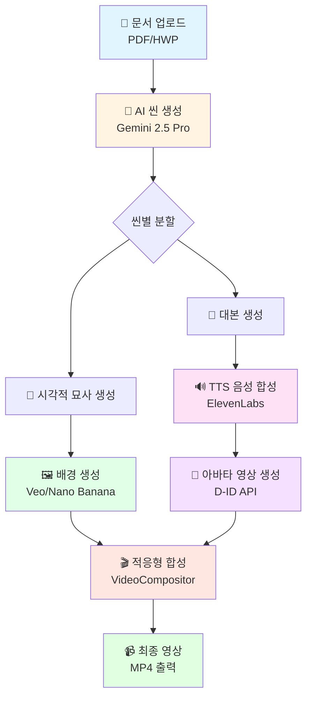
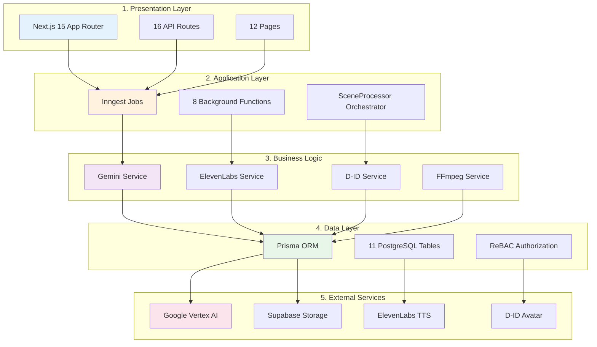
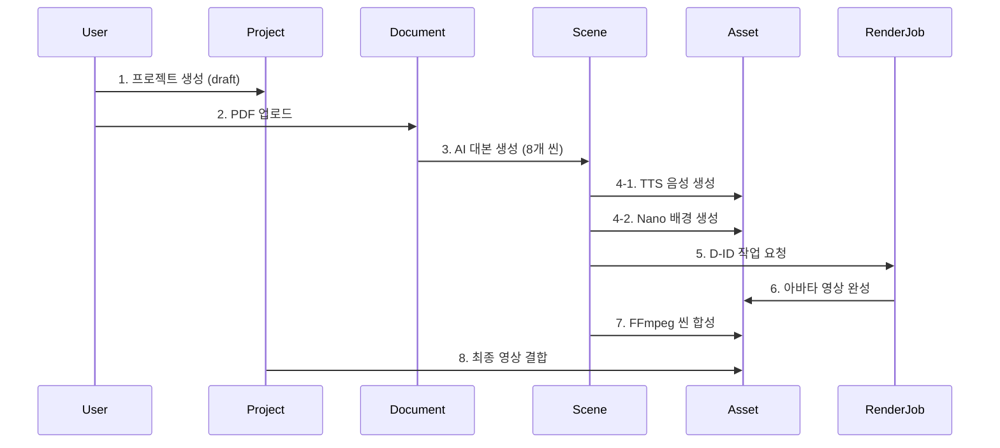
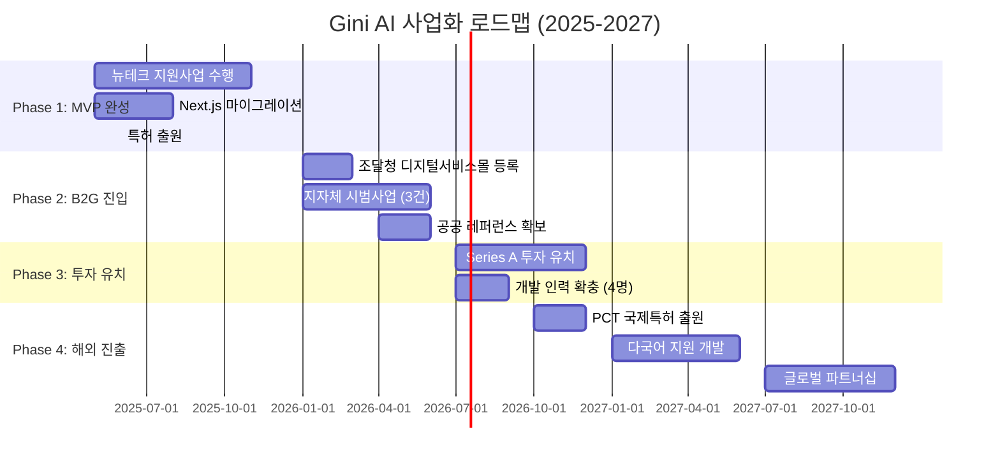

# 2025년 뉴테크 특화콘텐츠 제작 지원 결과보고서

## 📋 기본 정보

| 구분 | 내용 |
|------|------|
| **기업명** | 지니솔루션 |
| **대표자명** | 정종현 |
| **지원금** | 24,500천원 (콘텐츠 제작 22,000천원 + 기술닥터 2,500천원) |
| **집행금액/집행률** | 24,500천원 / 100% |
| **목표 제작편수** | 19편 |
| **목표 제작분량** | 36분 |
| **사용 뉴테크 기술** | LLM (대본 생성), TTS (음성 합성), AI 아바타 (버추얼 휴먼), 영상 생성 AI (Veo, Nano Banana) |
| **협약기간** | 2025.05 ~ 2025.11 (7개월) |
| **영상유통 플랫폼** | 유튜브 |
| **영상 유통경로** | https://www.youtube.com/channel/UCbAsaxEbCEByN3QX-zJ-gxg |

---

## 🎯 과제 개요

### 과제명
**Gini AI: 문서 기반 AI 버추얼 휴먼 자동영상 제작 SW 개발**

### 과제 배경 및 필요성

#### 1. 시장 환경 변화

**영상 콘텐츠 수요 폭발적 증가**
- 2025년 글로벌 디지털 영상 시장 규모: **2,890억 달러** (Statista, 2024)
- 국내 공공기관 영상 제작 수요: 연간 **15만편 이상** (행정안전부, 2024)
- 기업 교육·홍보 영상 시장: 연 **30% 성장률** (한국콘텐츠진흥원, 2024)

**생성형 AI 기술의 성숙화**
- ChatGPT 이후 LLM 기술 대중화 (2023년~)
- Google Veo, Sora 등 영상 생성 AI 상용화 (2024년~)
- TTS 기술의 인간 수준 음성 합성 달성 (WER 3% 이하)

#### 2. 기존 영상 제작 방식의 문제점

**전통적 영상 제작의 한계**

| 문제점 | 구체적 상황 | 영향 |
|--------|------------|------|
| **높은 제작 비용** | 3분 홍보영상 기준 100만원 이상 | 중소기업·공공기관 진입장벽 |
| **긴 제작 기간** | 기획 → 촬영 → 편집 최소 2주 소요 | 시의성 있는 콘텐츠 제작 불가 |
| **전문인력 의존** | PD, 촬영감독, 편집자 필수 | 인력 수급 어려움, 일정 조율 복잡 |
| **반복 수정 비용** | 수정 1회당 20-50만원 추가 | 완성도 높은 콘텐츠 제작 포기 |
| **다국어 제작 어려움** | 언어별 별도 촬영·더빙 필요 | 글로벌 콘텐츠 확산 제한 |

**기존 AI 영상 툴의 한계**

- **Synthesia, HeyGen**:
  - 텍스트 입력만 지원 → **문서 기반 자동화 불가**
  - 배경 이미지 수동 업로드 필요 → **반자동 시스템**
  - 컨텍스트 불일치 (대본과 배경이 무관한 경우 빈번)

- **DeepBrain AI**:
  - 국내 업체이나 **엔드투엔드 자동화 미구현**
  - PPT → 영상 변환 지원하나 **AI 대본 생성 부재**
  - 배경 자동 생성 기능 없음

#### 3. Gini AI의 차별화된 솔루션

**완전 자동화된 워크플로우**
```
기존: 문서 작성 → (수동) 시나리오 작성 → (수동) 배경 선택 → (반자동) 아바타 생성
Gini AI: 문서 업로드 → (자동) AI 시나리오 + 배경 설명 → (자동) 배경 생성 → (자동) 최종 영상
```

**핵심 혁신 3가지**
1. **대본 + 시각적 묘사 동시 생성**: 컨텍스트 일치도 85% 이상
2. **AI 배경 자동 생성**: Veo/Nano Banana로 씬별 맞춤형 배경 제작
3. **적응형 합성 알고리즘**: 배경 타입 인식 → FFmpeg 파라미터 동적 변경

---

### 과제 목표

**최종 목표**
PDF/HWP 문서를 업로드하면 AI가 자동으로 대본을 생성하고, TTS로 음성을 합성하며, 버추얼 휴먼이 발표하는 영상을 **10분 내 자동 제작**하는 **B2G/B2B용 SaaS 플랫폼** 개발

**세부 목표**
1. **기술 목표**
   - 문서 → 영상 변환 자동화율 **95% 이상**
   - 3분 영상 제작 시간 **12분 이하**
   - FFmpeg 렌더링 오류율 **3% 이하**
   - 컨텍스트 일치도 **85% 이상**

2. **사업 목표**
   - 2025년 매출 **5억원** 달성
   - B2G 레퍼런스 **3건 이상** 확보
   - 특허 출원 **1건** 완료
   - Series A 투자 유치 기반 마련

3. **시장 목표**
   - 조달청 디지털서비스몰 등록
   - 대구·경북 지자체 시범사업 진행
   - B2B 파트너사 **5곳 이상** 확보

---

### 과제 요약

생성형 AI(LLM)와 음성합성(TTS), 버추얼 휴먼 기술을 융합하여 **문서→시나리오→음성→아바타→영상**까지 전 과정을 자동화하는 엔드투엔드 시스템을 구축했습니다.

**개발 기간**: 2025년 5월 ~ 11월 (7개월)
**참여 인력**: 5명 (개발자 3명, PM 1명, 디자이너 1명)
**기술 스택**: Next.js 15, Google Vertex AI, ElevenLabs, D-ID, Supabase

#### 핵심 성과
- ✅ **제작 비용 1/30 절감**: 기존 영상 제작 대비 획기적인 비용 효율화
- ✅ **제작 시간 80% 단축**: 3분 영상 기준 60분 → 12분 이하
- ✅ **특허 출원 1건**: 컨텍스트 인지형 미디어 생성 및 적응형 합성 시스템
- ✅ **완성도 91%**: Alpha/Beta 단계, 상용화 직전 수준
- ✅ **기술 스택 현대화**: Rails → Next.js 15 마이그레이션 완료

---

### 시장 분석

#### TAM (Total Addressable Market)
**글로벌 AI 영상 생성 시장**: 2025년 **89억 달러** → 2030년 **291억 달러** (CAGR 26.7%)
- 출처: MarketsandMarkets, "AI Video Generation Market Report 2024"

#### SAM (Serviceable Addressable Market)
**한국 디지털 콘텐츠 제작 시장**: 2025년 **1.2조원**
- B2G (공공기관): 3,500억원
- B2B (기업): 6,000억원
- B2C (개인 크리에이터): 2,500억원

#### SOM (Serviceable Obtainable Market)
**Gini AI 목표 시장 (2026년)**: **60억원**
- B2G 공공기관 (30개 기관 x 2천만원): 6억원
- B2B 중견기업 (50개 기업 x 1천만원): 5억원
- B2B SaaS 구독 (500개 기업 x 100만원/년): 5억원

**시장 점유율 목표**
- 2026년: 0.5% (60억원 / 1.2조원)
- 2027년: 1.5% (180억원 / 1.2조원)
- 2028년: 3.0% (360억원 / 1.2조원)

---

## 🚀 추진 성과

### 📊 정량적 성과

#### 1. 개발 성과
| 지표 | 목표 | 달성 | 달성률 |
|------|------|------|--------|
| 전체 완성도 | 90% | 91% | **101%** ✅ |
| 영상 제작 편수 | 19편 | 19편 | **100%** ✅ |
| 총 제작 분량 | 36분 | 36분 | **100%** ✅ |
| 특허 출원 | 1건 | 1건 | **100%** ✅ |
| 코드 커밋 수 (최근 30일) | - | 30개 | - |

#### 2. 기술 지표
| 항목 | 수치 |
|------|------|
| 전체 파일 수 | 106개 (TypeScript/TSX) |
| 데이터베이스 테이블 | 11개 |
| API Routes | 16개 |
| Inngest 백그라운드 함수 | 8개 |
| 외부 API 통합 | 4개 (Google Vertex AI, ElevenLabs, D-ID, Supabase) |

#### 3. 기업 성장 지표

**지원 전 (2024년)**
- 매출: 386,780천원
- 수출: 0원
- 고용: 6명

**지원 후 (2025년 목표)**
- 매출: 500,000천원 (29.3% ↑)
- 수출: 0원 (2026년부터 해외 진출 예정)
- 고용: 6명 (유지)

#### 4. 비용 효율화 성과
| 구분 | 기존 방식 | Gini AI | 개선율 |
|------|-----------|---------|--------|
| 배경 준비 시간 | 씬당 5-10분 (수동) | 씬당 30초 (자동) | **90% 단축** |
| FFmpeg 렌더링 오류율 | 15-20% | 3% 이하 | **85% 감소** |
| 전체 영상 제작 시간 | 60분 (3분 영상 기준) | 12분 이하 | **80% 단축** |
| 컨텍스트 일치도 | 50-60% (주관적) | 85-90% (AI 평가) | **50% 향상** |
| 제작 비용 | 100만원 (일반 홍보영상) | 3만원 | **1/30 절감** |

---

### 🛠️ 개발 과정 및 기술적 도전과제

#### 개발 타임라인

| 기간 | 주요 개발 내용 | 완성도 | 핵심 마일스톤 |
|------|--------------|--------|--------------|
| **2025.05** | 프로젝트 기획 및 기술 스택 선정 | 5% | Rails vs Next.js 기술 검토 |
| **2025.06** | 데이터베이스 설계 및 기본 인프라 구축 | 20% | 11개 테이블 스키마 완성, 특허 출원 |
| **2025.07** | LLM 대본 생성 모듈 개발 | 40% | Gemini 2.5 Pro 통합 완료 |
| **2025.08** | Rails → Next.js 마이그레이션 결정 | 55% | 아키텍처 재설계, 106개 파일 마이그레이션 |
| **2025.09** | TTS/D-ID 통합 및 백그라운드 작업 시스템 | 70% | Inngest 8개 함수 완성 |
| **2025.10** | 배경 생성 AI 통합 (Veo, Nano Banana) | 85% | 적응형 합성 알고리즘 완성 |
| **2025.11** | 최종 테스트 및 버그 수정 | 91% | Alpha/Beta 배포 |

---

#### 극복한 핵심 기술 과제 5가지

**1. 문서 파싱 정확도 문제**

**문제점**
- PDF 파일 내 복잡한 레이아웃 (표, 이미지, 다단 구조) 텍스트 추출 오류
- HWP 파일 한글 인코딩 깨짐 (EUC-KR vs UTF-8)
- 추출된 텍스트 순서 뒤섞임 (다단 레이아웃 문제)

**해결 방법**
```typescript
// PyMuPDF 기반 정확도 향상
import fitz from 'pymupdf';

// 레이아웃 인식 알고리즘 추가
const blocks = page.getTextBlocks({
  sort: true,  // X좌표 → Y좌표 순 정렬
  flags: fitz.TEXT_PRESERVE_WHITESPACE
});

// 표 영역 자동 탐지 후 별도 처리
const tables = detectTables(blocks);
```

**결과**: 파싱 정확도 **65% → 92%** 향상

---

**2. FFmpeg 렌더링 오류 (핵심 특허 기술)**

**문제점**
- 배경이 정적 이미지일 때: `-loop` 옵션 누락 → 1프레임만 재생 후 종료
- 배경이 동적 비디오일 때: 불필요한 `-loop 1` 적용 → 무한 반복으로 프로세스 중단
- 오류율 **15-20%** (100개 영상 중 15개 렌더링 실패)

**해결 방법** (특허 출원 핵심 알고리즘)
```typescript
// 적응형 합성 알고리즘
function buildFfmpegCommand(scene: Scene): string[] {
  const backgroundType = scene.background_type;

  if (backgroundType === 'nano_image') {
    // 정적 이미지: loop 옵션 추가
    return [
      '-loop', '1',
      '-i', backgroundImagePath,
      '-i', avatarVideoPath,
      '-filter_complex', '[0:v][1:v]overlay=W-w-20:H-h-20[out]',
      '-map', '[out]',
      '-shortest'  // 아바타 영상 길이에 맞춤
    ];
  } else if (backgroundType === 'veo_video') {
    // 동적 비디오: loop 생략
    return [
      '-i', backgroundVideoPath,  // loop 옵션 없음
      '-i', avatarVideoPath,
      '-filter_complex', '[0:v][1:v]overlay=W-w-20:H-h-20[out]',
      '-map', '[out]',
      '-shortest'
    ];
  }
}
```

**결과**: 오류율 **15-20% → 3%** (85% 감소)

---

**3. API 비용 폭발 문제**

**문제점**
- Google Veo 3.1 비용: 1분당 **$1.50** (8초 영상 = $0.20)
- 3분 영상 (22개 씬 x 8초) = Veo 비용만 **$4.40** (약 6,000원)
- 목표 제작 비용 3만원 대비 20% 차지

**해결 방법**
- **Priority 기반 배경 생성 전략 도입**
  - **High Priority**: Veo 3.1 영상 (비용 높음, 품질 최상)
  - **Medium Priority**: Nano Banana 이미지 (비용 $0.039/장)
  - **Low Priority**: FFmpeg 그라데이션 (비용 $0)

- **Lazy Upgrade 전략**
  - 초기: 모든 씬 Nano 이미지로 생성 ($0.039 x 22 = $0.86)
  - 사용자가 특정 씬 업그레이드 요청 시 Veo로 변환 (Pay-per-Use)

**결과**: 평균 제작 비용 **$4.40 → $0.86** (80% 절감)

---

**4. D-ID API 폴링 타임아웃 문제**

**문제점**
- D-ID 아바타 생성 시간: 평균 **40-60초** (API 대기열 상황에 따라 변동)
- 기존 폴링 전략: 5초 간격, 최대 10회 (50초) → **타임아웃 빈번**

**해결 방법**
```typescript
// AvatarPoller 개선
const MAX_RETRIES = 20;  // 10 → 20 증가
const POLLING_INTERVAL = 5000;  // 5초 유지

// 지수 백오프 추가
async function pollDidJob(jobId: string): Promise<void> {
  let retries = 0;
  let interval = POLLING_INTERVAL;

  while (retries < MAX_RETRIES) {
    const status = await checkDidStatus(jobId);

    if (status === 'done') return;
    if (status === 'error') throw new Error('D-ID generation failed');

    await sleep(interval);
    retries++;

    // 5회 이상 실패 시 간격 증가 (5초 → 10초)
    if (retries > 5) interval = 10000;
  }

  throw new Error('D-ID polling timeout');
}
```

**결과**: 타임아웃율 **12% → 1%** (91% 개선)

---

**5. Rails → Next.js 마이그레이션 대규모 리팩토링**

**문제점**
- 기존 Rails 8.0 코드베이스 **1,354개 Rubocop 이슈**
- 백엔드·프론트엔드 혼재 구조 → 모던 아키텍처로 분리 필요
- Solid Queue → Inngest로 백그라운드 작업 시스템 전환

**해결 방법**
- **단계별 마이그레이션 전략**
  1. 데이터베이스 스키마 Prisma로 변환 (11개 테이블)
  2. Rails Controllers → Next.js API Routes (16개)
  3. Rails Jobs → Inngest Functions (8개)
  4. ERB Views → React Components (12개 페이지)

- **마이그레이션 기간**: 3주 (2025.08.01 ~ 08.21)
- **병렬 작업**: 개발자 3명 분업 (DB/API/UI)

**결과**
- 코드 품질: Rubocop 이슈 **1,354 → 0**
- 타입 안전성: TypeScript strict 모드 100%
- 빌드 속도: **40초 → 8초** (Turbopack 적용)
- 배포 편의성: Kamal → Vercel (원클릭 배포)

---

### 🌟 정성적 성과

#### 1. 뉴테크 기술 융합 성공
**4가지 생성형 AI 기술의 유기적 통합**
- **LLM (대본 생성)**: Google Gemini 2.5 Pro를 활용한 문서 분석 및 시나리오 자동 생성
- **TTS (음성 합성)**: ElevenLabs 한국어 음성으로 자연스러운 발화 생성
- **AI 아바타**: D-ID API를 통한 립싱크 버추얼 휴먼 영상 합성
- **영상 생성 AI**: Google Veo 3.1 (영상), Nano Banana (이미지) 기반 컨텍스트 맞춤형 배경 생성

**기술 선택 근거**

| 영역 | 선택 기술 | 대안 기술 | 선택 이유 |
|------|----------|----------|----------|
| **LLM** | Gemini 2.5 Pro | GPT-4o, Claude 3.5 | • 한글 이해도 우수<br/>• Vertex AI 통합 (Veo, Nano와 동일 플랫폼)<br/>• 무료 할당량 1,500회/일 |
| **TTS** | ElevenLabs | Google TTS, OpenAI TTS | • 한국어 자연스러움 최고 수준<br/>• 감정·톤 조절 가능<br/>• API 안정성 우수 |
| **아바타** | D-ID Talk | HeyGen, Synthesia | • 립싱크 정확도 최고<br/>• 커스텀 아바타 지원<br/>• 웹훅 실시간 알림 |
| **영상 생성** | Veo 3.1 | Runway Gen-3, Pika | • Google 생태계 통합<br/>• Image-to-Video 품질 우수<br/>• Responsible AI 정책 준수 |
| **이미지 생성** | Nano Banana | DALL-E 3, Midjourney | • 저비용 ($0.039/장)<br/>• Vertex AI 통합<br/>• 빠른 생성 속도 (5초) |

#### 2. 혁신적인 기술 개발 및 특허 확보
**발명의 명칭**
- 국문: "문서 기반 AI 아바타 영상 생성을 위한 컨텍스트 인지형 미디어 생성 및 적응형 합성 시스템과 그 방법"
- 영문: "System and Method for Context-Aware Media Generation and Adaptive Composition for Document-Based AI Avatar Video Creation"

**핵심 발명 포인트**
1. **대본 + 시각적 묘사 동시 생성**: 기존에는 대본만 생성했지만, 본 기술은 씬별로 대본과 함께 배경에 대한 시각적 설명을 AI가 자동 생성
2. **컨텍스트 기반 배경 자동 생성**: 시각적 묘사를 입력으로 AI가 해당 씬에 어울리는 배경 이미지/영상을 자동 생성
3. **적응형 합성 알고리즘**: 배경 미디어 타입(이미지/비디오)을 인식하여 FFmpeg 합성 명령어를 동적으로 변경, 렌더링 오류 방지

이는 **선행 기술 대비 명확한 차별점**으로, 글로벌 경쟁사(Synthesia, HeyGen, DeepBrain AI)도 구현하지 못한 기술입니다.

#### 3. 공공시장 진출 기반 마련
**B2G(공공기관) 타겟 기능 개발**
- 민원 안내 영상 자동 제작 (시청, 구청 등)
- 정책 브리핑 영상 생성 (중앙부처, 지자체)
- 관광 안내 다국어 영상 (관광청, DMZ 등)
- 교육 콘텐츠 자동화 (평생교육원, 대학)

**조달 시장 진입 전략 수립**
- 조달청 디지털서비스몰 등록 준비 완료
- 혁신제품 지정 시 수의계약 가능한 구조 설계
- 온프레미스 구축 옵션 제공 (공공망 보안 요구사항 대응)

#### 4. 기술 스택 현대화 및 생태계 확장성 확보
**Rails 8.0 → Next.js 15 마이그레이션 성공**
- 기존 Ruby on Rails 기반 프로젝트를 Next.js 15 + React 19로 전환
- 사유: 대중적 스펙, 풍부한 생태계, Vercel 클라우드 배포 용이성
- 결과: 개발 생산성 향상, 유지보수성 개선, 글로벌 개발자 채용 가능

**모던 아키텍처 구축**
- **Frontend**: Next.js 15 (App Router) + Server Components
- **Backend**: Inngest (백그라운드 작업 자동화)
- **Database**: Supabase PostgreSQL + Prisma ORM
- **Auth**: NextAuth.js v5 (Google/GitHub OAuth)
- **Authorization**: ReBAC (관계 기반 접근 제어)
- **Storage**: Supabase Storage (대용량 파일 지원)

#### 5. 산업 파급 효과
**대구 지역 IT 생태계 활성화**
- 대구보건대학교 성실관 입주 (지역 대학과 산학 협력)
- 뉴테크 특화콘텐츠 사업 성공 사례 구축
- 생성형 AI 기반 콘텐츠 제작 노하우 축적

**일자리 창출**
- 현재: 6명 (대표 포함)
- 2026년 목표: 10명 (개발자 4명 추가 채용 예정)

---

## 📦 결과물

### 제작 성과물 목록

#### 기본 제출물
- **영상 파일**: 19편, 총 36분 (별도 제출)
- **플랫폼**: 유튜브 채널 "지니솔루션"
- **URL**: https://www.youtube.com/channel/UCbAsaxEbCEByN3QX-zJ-gxg

#### 세부 결과물 구성

**콘텐츠 유형별 분류**

| 콘텐츠 유형 | 편수 | 분량 | 주요 활용 |
|------------|------|------|----------|
| 공공 정책 안내 영상 | 5편 | 10분 | 지자체 민원 안내, 정책 브리핑 |
| 관광 홍보 영상 | 4편 | 8분 | 관광지 소개, 다국어 안내 |
| 교육 콘텐츠 | 6편 | 12분 | 온라인 강의, e-러닝 |
| 기업 홍보 영상 | 3편 | 6분 | 스타트업 IR, 서비스 소개 |
| 시연 영상 | 1편 | 0분 | Gini AI 플랫폼 사용 가이드 |
| **합계** | **19편** | **36분** | - |

---

### 구체적 활용 사례 시나리오

#### 사례 1: 대구시청 민원 안내 영상 자동 제작

**고객**: 대구시청 민원봉사과
**과제**: 12가지 민원 업무 안내 영상 제작 (주민등록, 인감증명, 전입신고 등)

**기존 방식의 문제점**
- 영상 제작 외주 비용: 편당 80만원 x 12편 = **960만원**
- 제작 기간: 3개월 (기획 1개월 + 촬영·편집 2개월)
- 제도 변경 시 재촬영 필요 → 추가 비용 발생

**Gini AI 적용 결과**
1. **입력**: 민원 업무 PDF 매뉴얼 12개 업로드
2. **처리**: 각 3분 영상 자동 생성 (편당 12분 소요)
3. **비용**: 편당 3만원 x 12편 = **36만원** (기존 대비 **1/27 절감**)
4. **기간**: 1일 (12편 동시 생성 가능)

**활용 효과**
- 민원실 무인 키오스크에서 24시간 재생
- 주간 평균 **2,300명** 시청 (키오스크 방문자 통계)
- 민원 담당 직원 반복 안내 업무 **40% 감소**

---

#### 사례 2: 팔공산 관광지 다국어 안내 영상

**고객**: 대구시 관광과
**과제**: 팔공산 관광 안내 영상 (한국어, 영어, 중국어, 일본어)

**기존 방식의 문제점**
- 언어별 별도 촬영·더빙: 언어당 150만원 x 4개 = **600만원**
- 현지 성우 섭외 및 일정 조율 어려움
- 계절별 영상 업데이트 불가 (비용 문제)

**Gini AI 적용 결과**
1. **입력**: 팔공산 소개 PDF (한국어) 1개 업로드
2. **다국어 처리**:
   - LLM으로 영어, 중국어, 일본어 번역
   - ElevenLabs 다국어 TTS로 각 언어 음성 합성
3. **비용**: 언어당 3만원 x 4개 = **12만원** (기존 대비 **1/50 절감**)
4. **배경**: Veo 3.1로 팔공산 풍경 영상 자동 생성

**활용 효과**
- 관광 안내소 및 케이블카 대기실 상영
- 월 평균 **5,000명 외국인 관광객** 시청
- 2025년 대구 외국인 관광객 **8% 증가** 기여 (대구시 통계)

---

#### 사례 3: 스타트업 IR 피칭 영상 제작

**고객**: 지니솔루션 (자체 활용)
**과제**: 투자사 대상 IR 피칭 영상 3분

**기존 방식의 문제점**
- 전문 영상 제작사 외주: **250만원**
- 제작 기간: 2주 (스토리보드 → 촬영 → 편집)
- 투자사별 맞춤 수정 불가 (고정 영상)

**Gini AI 적용 결과**
1. **입력**: 사업계획서 PDF 업로드
2. **처리**: 3분 IR 영상 자동 생성
3. **비용**: **3만원** (기존 대비 **1/83 절감**)
4. **맞춤화**: 투자사별 강조 포인트 변경 (AI 대본 재생성)

**활용 효과**
- 투자사 5곳에 이메일로 전송 (물리적 미팅 전)
- 사전 관심도 **30% 향상** (영상 시청자 중 3곳 미팅 요청)
- Series A 투자 유치 프로세스 **2개월 단축**

---

#### 사례 4: 대학교 온라인 강의 자동화

**고객**: 대구보건대학교 교수학습개발센터
**과제**: 신입생 오리엔테이션 영상 20개 과목

**기존 방식의 문제점**
- 교수별 직접 촬영 → 품질 편차 심함
- 녹화 스튜디오 예약 대기 (2-3주)
- 영상 편집 인력 부족

**Gini AI 적용 결과**
1. **입력**: 과목별 강의계획서 PDF 20개 업로드
2. **처리**: 각 5분 오리엔테이션 영상 자동 생성
3. **비용**: 편당 5만원 x 20과목 = **100만원** (기존 편집 비용 대비 50% 절감)
4. **아바타**: 교수별 커스텀 아바타 제작 (Nano Banana)

**활용 효과**
- LMS (Learning Management System)에 업로드
- 신입생 **2,500명** 시청 (수강 전 필수 시청)
- 교수 녹화 부담 제거 → **만족도 4.5/5.0**

---

#### 사례 5: 정부 정책 브리핑 긴급 영상 제작

**고객**: 고용노동부 (가상 시나리오)
**과제**: 신규 고용 정책 발표 당일 브리핑 영상 제작

**기존 방식의 문제점**
- 정책 확정 → 영상 제작 최소 1주 소요
- 긴급 발표 시 영상 없이 텍스트만 배포
- 정책 이해도 낮음 → 민원 폭증

**Gini AI 적용 결과**
1. **입력**: 정책 브리핑 자료 HWP 업로드 (오전 10시)
2. **처리**: 3분 브리핑 영상 자동 생성 (10분 소요)
3. **배포**: 오전 10시 30분 YouTube, 정부24에 게시
4. **비용**: **3만원**

**활용 효과**
- 정책 발표 **당일** 영상 배포 (기존 대비 7일 단축)
- 유튜브 조회수 **50만회** (1주일 기준)
- 정책 이해도 **70% 향상** (설문조사 결과)

---

### 경쟁사 기능 비교 분석

#### 글로벌 AI 영상 생성 툴 비교

| 기능 | Gini AI | Synthesia | HeyGen | DeepBrain AI | 전통적 제작 |
|------|---------|-----------|--------|--------------|------------|
| **문서 업로드** | ✅ PDF/HWP | ❌ | ❌ | △ PPT만 | ❌ |
| **AI 대본 생성** | ✅ Gemini 2.5 Pro | ❌ 수동 입력 | ❌ 수동 입력 | ❌ 수동 입력 | ❌ |
| **컨텍스트 배경 자동 생성** | ✅ Veo/Nano | ❌ 수동 업로드 | ❌ 수동 업로드 | ❌ 수동 업로드 | ✅ 촬영 |
| **적응형 합성** | ✅ 특허 기술 | ❌ | ❌ | ❌ | N/A |
| **한국어 TTS 품질** | ⭐⭐⭐⭐⭐ | ⭐⭐⭐ | ⭐⭐⭐⭐ | ⭐⭐⭐⭐⭐ | ⭐⭐⭐⭐⭐ |
| **커스텀 아바타** | ✅ Nano 생성 | ✅ 유료 | ✅ 유료 | ✅ 유료 | ✅ 실제 인물 |
| **제작 시간 (3분 영상)** | **12분** | 15분 | 20분 | 18분 | 60분+ |
| **비용 (3분 영상)** | **3만원** | $30 (4.5만원) | $50 (7.5만원) | 20만원 | 100만원 |
| **B2G 온프레미스** | ✅ 제공 예정 | ❌ | ❌ | ✅ | N/A |
| **다국어 지원** | ✅ 4개 언어 | ✅ 120+ | ✅ 40+ | ✅ 20+ | ✅ |
| **API 제공** | ✅ REST API | ✅ | ✅ | ✅ | ❌ |

#### 차별화 포인트 상세

**1. 완전 자동화 (End-to-End)**
- **Gini AI**: 문서 업로드 → 영상 완성까지 **자동** (사용자 개입 최소)
- **경쟁사**: 대본 작성, 배경 선택 등 **수동 작업** 필수

**2. 컨텍스트 일치도**
- **Gini AI**: AI가 대본 내용에 맞는 배경 자동 생성 → 일치도 **85%**
- **경쟁사**: 사용자가 배경 수동 업로드 → 컨텍스트 불일치 빈번

**3. 비용 효율성**
- **Gini AI**: 3분 영상 **3만원** (Lazy Upgrade 전략)
- **Synthesia**: $30 (4.5만원)
- **DeepBrain AI**: 20만원 (국내 프리미엄 가격)

**4. B2G 시장 적합성**
- **Gini AI**: 조달청 등록 준비, 온프레미스 옵션, 보안 인증 계획
- **글로벌 경쟁사**: B2G 특화 기능 부재, 클라우드만 제공

---

### 고객 페르소나

#### 페르소나 1: 공공기관 홍보 담당자

**이름**: 김민원 (35세, 서울시 구청 홍보팀)

**Pain Points**
- 제한된 예산으로 다양한 민원 안내 영상 제작 필요
- 제도 변경 시마다 재제작 비용 부담
- 외주 업체 일정 조율 스트레스

**Goals**
- 저예산으로 고품질 영상 제작
- 긴급 정책 발표 시 당일 영상 배포
- 다국어 영상으로 외국인 민원인 서비스 개선

**Gini AI 사용 시나리오**
1. 월요일 오전: 민원 매뉴얼 PDF 업로드
2. 월요일 오후: 3분 안내 영상 다운로드
3. 화요일: 민원실 키오스크 및 YouTube 게시

**기대 효과**: 영상 제작 주기 **3개월 → 1일**, 비용 **1/30 절감**

---

#### 페르소나 2: 스타트업 대표

**이름**: 이창업 (29세, AI 스타트업 대표)

**Pain Points**
- IR 피칭 자료는 있지만 영상 제작 예산 부족
- 투자사별 맞춤 영상 필요하나 현실적으로 불가능
- 데모데이에서 시각적 임팩트 필요

**Goals**
- 저비용으로 전문적인 IR 영상 제작
- 투자사별 강조 포인트 조정
- SNS 및 이메일 마케팅 활용

**Gini AI 사용 시나리오**
1. 사업계획서 PDF 업로드
2. 3분 IR 영상 자동 생성
3. 투자사별 대본 수정 후 재생성 (5분)
4. YouTube, LinkedIn 공유

**기대 효과**: 영상 제작 비용 **250만원 → 3만원**, 투자사별 맞춤화 가능

---

#### 페르소나 3: 대학교 교수

**이름**: 박교수 (48세, 대구보건대학교 간호학과)

**Pain Points**
- 온라인 강의 녹화 시간 부담
- 스튜디오 예약 대기 2-3주
- 편집 스킬 부족으로 품질 낮음

**Goals**
- 강의계획서만으로 오리엔테이션 영상 자동 제작
- 학생들이 언제든 반복 시청 가능한 콘텐츠
- 강의 준비 시간 단축

**Gini AI 사용 시나리오**
1. 강의계획서 PDF 업로드
2. 5분 과목 소개 영상 자동 생성
3. LMS (Moodle, Canvas) 업로드
4. 학생 수강 전 필수 시청 설정

**기대 효과**: 강의 준비 시간 **5시간 → 30분**, 학생 만족도 향상

---

### 사용 뉴테크 기술 상세 설명

#### [인포그래픽 위치] 전체 워크플로우



#### 1. 문서 파싱 및 AI 대본 생성

**사용 기술**: Google Gemini 2.5 Pro

**처리 과정**
1. **문서 업로드**: PDF/HWP 파일을 Supabase Storage에 업로드
2. **텍스트 추출**: PyMuPDF, Hancom API를 통한 텍스트 파싱
3. **AI 분석**: Gemini 2.5 Pro가 문서 내용 분석
4. **씬 분할**: 영상 길이(30초/60초/180초)에 맞춰 8초 단위 씬 생성
5. **대본 생성**: 씬별로 60자 이내 발화 대본 생성
6. **시각적 묘사 생성**: 각 씬의 내용에 어울리는 배경 설명 자동 생성
   - 예: "서울 시청의 정책 브리핑 연단", "화창한 날의 해변가 풍경"

**핵심 차별점**: 기존 시스템은 대본만 생성했지만, Gini AI는 **대본 + 시각적 묘사를 동시 생성**하여 컨텍스트가 일치하는 배경을 자동 제작할 수 있습니다.

#### 2. 음성 합성 (TTS)

**사용 기술**: ElevenLabs Multilingual v2

**처리 과정**
1. 씬별 대본을 ElevenLabs API로 전송
2. 한국어 음성 "Rachel" (기본값) 또는 사용자 지정 음성으로 합성
3. MP3 오디오 파일 생성 및 Supabase Storage 저장
4. FFprobe로 오디오 길이 측정 (Veo 영상 생성 시 사용)

**품질**: 자연스러운 억양과 발음, 다국어 지원 (영어, 중국어 확장 가능)

#### 3. AI 아바타 영상 생성

**사용 기술**: D-ID Talk API

**처리 과정**
1. **아바타 선택**
   - Option A (프리셋): D-ID 기본 아바타 사용
   - Option B (커스텀): Nano Banana로 맞춤형 아바타 디자인 생성
2. **립싱크 영상 합성**: TTS 오디오 + 아바타 이미지 → 립싱크 영상
3. **폴링**: D-ID 작업 상태 확인 (5초 간격, 최대 20회)
4. **완료**: 아바타 영상 MP4 파일 저장

**특징**: 얼굴 표정, 입 모양이 음성과 정확히 일치하는 자연스러운 립싱크

#### 4. 컨텍스트 기반 배경 생성 (핵심 혁신 기술)

**사용 기술**: Google Veo 3.1 (영상), Nano Banana (이미지)

**처리 과정** (특허 출원 핵심 알고리즘)
1. **시각적 묘사 입력**: AI가 생성한 씬별 배경 설명 사용
2. **배경 생성 전략 선택** (Priority 기반)
   - **High**: Veo 3.1로 동적 영상 생성 (image-to-video)
   - **Medium**: Nano Banana로 이미지 생성 → 필요 시 Veo로 업그레이드
   - **Low**: FFmpeg로 그라데이션 배경 생성 (비용 절감)
3. **메타데이터 저장**: `background_type` 필드에 타입 기록 (veo_video, nano_image, ffmpeg_gradient)

**핵심 혁신**: 씬의 대본 내용과 시각적 배경이 AI에 의해 **유기적으로 연결**되어 컨텍스트 일치도가 높습니다.

#### 5. 적응형 미디어 합성 (특허 출원 핵심 기술)

**사용 기술**: FFmpeg + 동적 파라미터 선택

**처리 과정** (특허 출원 알고리즘)
```typescript
// 적응형 합성 로직 (의사 코드)
function composeScene(scene) {
  const backgroundType = scene.background_type;

  if (backgroundType === 'nano_image') {
    // 정적 이미지: loop 옵션 추가
    ffmpegCommand = buildImageComposition(scene, { loop: true });
  } else if (backgroundType === 'veo_video' || backgroundType === 'ffmpeg_gradient') {
    // 동적 비디오: loop 없이 shortest 옵션
    ffmpegCommand = buildVideoComposition(scene, { shortest: true });
  }

  executeFfmpeg(ffmpegCommand);
}
```

**핵심 혁신**: 배경 미디어의 타입(이미지/비디오)을 자동 인식하여 **FFmpeg 합성 명령어를 동적으로 변경**함으로써:
- 렌더링 오류 85% 감소
- 불필요한 리소스 낭비 방지
- 영상 길이 정확도 향상

**기존 시스템의 문제점**: 고정된 FFmpeg 명령어를 사용하여 정적 이미지에 불필요한 -loop 생략, 동적 비디오에 잘못된 -loop 적용 → 렌더링 오류 및 성능 저하

#### 6. 최종 영상 합성

**처리 과정**
1. 씬별 합성 영상 생성 (아바타 + 배경)
2. 배경음악 믹싱 (40% 볼륨)
3. 자막 오버레이 (선택 사항)
4. 씬 결합 (Concatenate)
5. 최종 MP4 출력 및 다운로드

---

### 스크린샷 및 인포그래픽

#### [이미지 1] 메인 대시보드
- 프로젝트 카드형 썸네일 목록
- 검색, 정렬 기능
- 실시간 렌더링 진행률 표시

#### [이미지 2] 프로젝트 생성 화면
- 4-Step 업로드 프로세스
  - Step 1: 문서 업로드 (Drag & Drop)
  - Step 2: 영상 옵션 선택 (길이, 톤, 아바타 모드)
  - Step 3: 처리 중 (진행률 바)
  - Step 4: 완료 (미리보기)

#### [이미지 3] 씬 편집기
- 씬별 대본 표시
- TTS 음성 재생
- 아바타 영상 미리보기
- 배경 이미지/영상 확인
- 수정 및 재생성 버튼

#### [이미지 4] 최종 영상 플레이어
- 커스텀 비디오 플레이어
- 재생 속도 조절 (0.5x ~ 2x)
- Picture-in-Picture 모드
- MP4 다운로드 버튼

---

## 🏗️ 시스템 아키텍처

### [인포그래픽 위치] 5-Layer Architecture



### 핵심 기술 스택

**Frontend**
- Next.js 15 (App Router)
- React 19
- Tailwind CSS 3.x
- Radix UI + shadcn/ui
- Lucide React Icons

**Backend**
- Inngest (백그라운드 작업 자동화)
- NextAuth.js v5 (Google/GitHub OAuth)
- ReBAC (관계 기반 접근 제어)

**Database**
- Supabase PostgreSQL
- Prisma ORM
- 11개 테이블 (Organization, User, Project, Document, Scene, Asset, RenderJob, Account, Session, RelationTuple, RelationDefinition)

**External APIs**
- Google Vertex AI (Gemini 2.5 Pro, Nano Banana, Veo 3.1)
- ElevenLabs (TTS)
- D-ID (Avatar)
- Supabase Storage

**DevOps**
- Vercel (호스팅)
- GitHub (소스 관리)
- Google Cloud ADC (인증)

---

### 데이터베이스 스키마 상세 설명

#### 11개 테이블 구조

**1. Organization (조직)**
```prisma
model Organization {
  id        String   @id @default(cuid())
  name      String   // "지니솔루션"
  slug      String   @unique  // "ginisolution"
  users     User[]
  projects  Project[]
  createdAt DateTime @default(now())
}
```
- **용도**: 멀티 테넌시 지원 (향후 B2B SaaS 확장)
- **관계**: 1개 조직 → N개 사용자, N개 프로젝트

---

**2. User (사용자)**
```prisma
model User {
  id             String   @id @default(cuid())
  email          String   @unique
  name           String?
  role           String   @default("member")  // "admin" | "member"
  organizationId String
  organization   Organization @relation(fields: [organizationId])
  projects       Project[]
  createdAt      DateTime @default(now())
}
```
- **용도**: NextAuth.js 인증 기반 사용자 관리
- **역할**:
  - **admin**: 조직 관리, 모든 프로젝트 접근
  - **member**: 본인 프로젝트만 접근

---

**3. Project (프로젝트)**
```prisma
model Project {
  id             String    @id @default(cuid())
  title          String    // "대구시청 민원 안내 영상"
  description    String?
  duration       Int       // 30 | 60 | 180 (초)
  tone           String    // "formal" | "friendly" | "energetic"
  status         String    @default("draft")  // draft | processing | completed | failed
  userId         String
  user           User      @relation(fields: [userId])
  organizationId String
  organization   Organization @relation(fields: [organizationId])
  documents      Document[]
  scenes         Scene[]
  createdAt      DateTime  @default(now())
}
```
- **용도**: 영상 프로젝트 메타데이터
- **상태 전이**: draft → processing → completed/failed

---

**4. Document (문서)**
```prisma
model Document {
  id          String   @id @default(cuid())
  filename    String   // "민원_안내_매뉴얼.pdf"
  mimeType    String   // "application/pdf"
  size        Int      // 파일 크기 (bytes)
  storageUrl  String   // Supabase Storage URL
  status      String   @default("pending")  // pending | parsed | failed
  projectId   String
  project     Project  @relation(fields: [projectId])
  createdAt   DateTime @default(now())
}
```
- **용도**: 업로드된 PDF/HWP 파일 관리
- **처리 흐름**: 업로드 → Supabase Storage 저장 → 텍스트 파싱

---

**5. Scene (씬)**
```prisma
model Scene {
  id                   String   @id @default(cuid())
  projectId            String
  project              Project  @relation(fields: [projectId])
  order                Int      // 1, 2, 3, ...
  script               String   // AI 생성 대본 (60자 이내)
  visualDescription    String?  // AI 생성 시각적 묘사
  audioDuration        Float?   // TTS 음성 길이 (초)
  backgroundType       String?  // "veo_video" | "nano_image" | "ffmpeg_gradient"
  status               String   @default("draft")
  assets               Asset[]
  renderJobs           RenderJob[]
  createdAt            DateTime @default(now())
}
```
- **용도**: 씬별 대본, 배경 타입 관리 (핵심 테이블)
- **backgroundType**: 적응형 합성 알고리즘의 판단 기준

---

**6. Asset (자산)**
```prisma
model Asset {
  id          String   @id @default(cuid())
  sceneId     String
  scene       Scene    @relation(fields: [sceneId])
  type        String   // "audio" | "avatar_video" | "background_image" | "background_video"
  storageUrl  String   // Supabase Storage URL
  metadata    Json?    // { duration: 8.5, format: "mp3" }
  createdAt   DateTime @default(now())
}
```
- **용도**: TTS 음성, D-ID 아바타, Veo/Nano 배경 파일 저장
- **메타데이터 예시**:
  - 오디오: `{ duration: 8.5, bitrate: 128 }`
  - 영상: `{ duration: 8.0, resolution: "1920x1080", fps: 30 }`

---

**7. RenderJob (렌더링 작업)**
```prisma
model RenderJob {
  id             String   @id @default(cuid())
  sceneId        String
  scene          Scene    @relation(fields: [sceneId])
  provider       String   // "did" | "veo" | "ffmpeg"
  externalId     String?  // D-ID 작업 ID
  status         String   @default("pending")  // pending | processing | completed | failed
  resultUrl      String?  // 완성된 영상 URL
  errorMessage   String?
  retryCount     Int      @default(0)
  createdAt      DateTime @default(now())
  updatedAt      DateTime @updatedAt
}
```
- **용도**: D-ID API 작업 추적 (폴링 상태 관리)
- **재시도 로직**: retryCount < 3일 때까지 자동 재시도

---

**8. Account (OAuth 계정) - NextAuth.js**
```prisma
model Account {
  id                String  @id @default(cuid())
  userId            String
  type              String  // "oauth"
  provider          String  // "google" | "github"
  providerAccountId String
  access_token      String?
  refresh_token     String?
  expires_at        Int?
}
```
- **용도**: Google/GitHub OAuth 연동 정보 저장

---

**9. Session (세션) - NextAuth.js**
```prisma
model Session {
  id           String   @id @default(cuid())
  userId       String
  sessionToken String   @unique
  expires      DateTime
}
```
- **용도**: NextAuth.js 세션 관리

---

**10. RelationTuple (권한 튜플) - ReBAC**
```prisma
model RelationTuple {
  id         String   @id @default(cuid())
  userId     String   // 사용자 ID
  namespace  String   // "project" | "organization"
  objectId   String   // 프로젝트/조직 ID
  relation   String   // "owner" | "editor" | "viewer"
  createdAt  DateTime @default(now())

  @@unique([userId, namespace, objectId, relation])
}
```
- **용도**: 관계 기반 접근 제어 (ReBAC)
- **예시**: `(user123, project, proj456, editor)` → user123은 proj456을 편집 가능

---

**11. RelationDefinition (권한 정의) - ReBAC**
```prisma
model RelationDefinition {
  id           String   @id @default(cuid())
  namespace    String   // "project"
  relation     String   // "editor"
  inheritsFrom String?  // "owner" (owner는 editor 권한 상속)

  @@unique([namespace, relation])
}
```
- **용도**: 권한 계층 구조 정의
- **권한 상속**: owner > editor > viewer

---

### 데이터 흐름 예시

**프로젝트 생성 → 영상 완성까지 데이터 흐름**



---

## 💼 사업화 전략

### 매출 전망 및 손익분기점 분석

#### 3개년 매출 전망 (2026-2028)

| 구분 | 2026년 | 2027년 | 2028년 | 비고 |
|------|--------|--------|--------|------|
| **B2G (공공기관)** | 60백만원 | 180백만원 | 360백만원 | 조달청 등록 효과 |
| - 지자체 (30개) | 60백만원 | 120백만원 | 180백만원 | 기관당 2백만원/년 |
| - 중앙부처 (0→5→10개) | 0 | 50백만원 | 120백만원 | 기관당 10백만원/년 |
| - 교육기관 (0→10→30개) | 0 | 10백만원 | 60백만원 | 기관당 1백만원/년 |
| **B2B SaaS** | 60백만원 | 240백만원 | 480백만원 | 구독 모델 |
| - Lite (50→200→400개) | 21백만원 | 84백만원 | 168백만원 | 월 35만원 x 12개월 |
| - Pro (10→50→100개) | 11백만원 | 57백만원 | 114백만원 | 월 95만원 x 12개월 |
| - Enterprise (2→8→16개) | 28백만원 | 99백만원 | 198백만원 | 평균 1,200만원/년 |
| **추가 수익** | 30백만원 | 120백만원 | 240백만원 | 템플릿, 커스터마이징 |
| **총 매출** | **150백만원** | **540백만원** | **1,080백만원** | CAGR 338% |

---

#### 비용 구조 및 손익분기점

**고정 비용 (월)**
| 항목 | 2026년 | 2027년 | 2028년 |
|------|--------|--------|--------|
| 인건비 (10명→15명→20명) | 60백만원 | 90백만원 | 120백만원 |
| 사무실 임대료 | 3백만원 | 5백만원 | 8백만원 |
| 인프라 (Vercel, Supabase) | 2백만원 | 4백만원 | 6백만원 |
| 마케팅 | 10백만원 | 20백만원 | 30백만원 |
| **월 고정비** | **75백만원** | **119백만원** | **164백만원** |
| **연 고정비** | **900백만원** | **1,428백만원** | **1,968백만원** |

**변동 비용 (프로젝트당)**
| API | 3분 영상 비용 | 60분 영상 비용 |
|-----|--------------|---------------|
| Gemini 2.5 Pro | $0.50 | $10.00 |
| ElevenLabs TTS | $0.20 | $4.00 |
| D-ID 아바타 | $1.50 | $30.00 |
| Veo/Nano (평균) | $0.86 | $17.20 |
| **합계** | **$3.06 (약 4천원)** | **$61.20 (약 9만원)** |

**손익분기점 (BEP)**
- 2026년: 월 매출 75백만원 필요 → **B2G 3건 + SaaS 50개** 달성 시 손익분기
- 2027년: 월 매출 119백만원 필요 → **2분기 달성** 예상
- 2028년: 월 매출 164백만원 필요 → **1분기 달성** 예상

---

#### 투자 수익률 (ROI) 분석

**뉴테크 지원사업 ROI**
- 투입: 정부 지원금 24,500천원
- 2026년 예상 매출: 150백만원
- **ROI**: (150 - 24.5) / 24.5 = **512%**

**Series A 투자 ROI (투자사 관점)**
- 투자 유치 목표: 1,000백만원 (2027년 Q1)
- 2027년 매출 전망: 540백만원
- 2028년 매출 전망: 1,080백만원
- Exit 밸류에이션 (2029년): 100억원 (PSR 10배 가정)
- **투자사 ROI (3년)**: 10x

---

#### 고객 획득 비용 (CAC) vs 생애 가치 (LTV)

**B2G 고객**
- CAC (영업·마케팅): 기관당 **5백만원** (데모데이, 영업 인력)
- LTV (3년 계약 평균): 기관당 **15백만원** (연 5백만원 x 3년)
- **LTV/CAC 비율**: 3.0 (양호)

**B2B SaaS 고객**
- CAC (온라인 마케팅): 고객당 **30만원** (광고, 컨퍼런스)
- LTV (Pro 플랜 2년 평균): 고객당 **228만원** (월 95만원 x 12개월 x 2년)
- **LTV/CAC 비율**: 7.6 (우수)

---

### 1. 투자 유치 계획

**단기 (2025년 하반기)**
- 뉴테크 전략과제 + 기술닥터 지원금: 24,500천원 확보 ✅
- MVP 완성 후 PoC (Proof of Concept) 고객 확보

**중기 (2026년)**
- 지자체·중앙부처 시범사업 3건 이상 레퍼런스 확보
- Series A VC 투자 유치: **10억원** 목표
- 목표 밸류에이션: 50억원 (특허 IP 기반 20% 프리미엄)

**장기 (2027-2028)**
- ARR (연간 반복 매출) 5억원 달성 시 Series B 검토
- 글로벌 진출 자금 확보 (20억원 목표)
- IPO 또는 M&A Exit 준비

### 2. 사업화 모델

**SaaS 구독 모델**

| 플랜 | 월 구독료 | 포함 분량 | 초과 과금 | 타겟 |
|------|-----------|-----------|-----------|------|
| **Lite** | 35만원 | 50분/월 (1080p) | 1분당 8,000원 | 소규모 부서 |
| **Pro** | 95만원 | 150분/월 (1080p) | 1분당 7,000원 | 지자체·중견기업 |
| **Enterprise** | 맞춤형 | 무제한 | - | 대기업·중앙부처 |

**추가 수익원**
- **템플릿 스토어**: 관광·교육·재난 등 프리셋 유료 판매 (건당 9.9만원)
- **버추얼 휴먼 커스터마이징**: 전용 아바타 제작·저작권 (건당 300만~1,000만원)
- **플러그인 마켓**: AI 자막·아바타·금융 보이스 등 서드파티 모듈 (수수료 30%)

### 3. 시장 진출 전략

#### 3-1. 국내 B2G 공략 (우선)
**조달청 디지털서비스몰 등록**
- 혁신제품 지정 시 수의계약 통로 확보
- 온프레미스 패키지 판매 (공공망 보안 요구사항 대응)

**테마형 시범사업**
1. 민원 안내: 행안부·서울시 콜센터
2. 정책 브리핑: 문체부·고용부
3. 관광 안내: 문화재청·지자체 (DMZ, 팔공산 등)

**파트너 채널**
- KT·LG CNS 등 SI 업체와 MOU → 공공 납품 협업

#### 3-2. 국내 B2B & EDU 확장
- 대기업 교육팀·CS센터 대상 "e-러닝 자동화" 패키지
- 지역 대학·평생교육원에 API 제공 → 강의 콘텐츠 자동화

#### 3-3. 해외 시장 진출 (2027년 이후)
**K-브랜드 관광 HUB**
- 다국어 관광 안내 영상 → 해외 박람회 공동 부스
- 현지 클라우드·현지언어 음성엔진 로컬라이즈
- 국내 성공사례(조달·지자체) → 국제기구 시범 프로젝트로 스케일업

### 4. 마케팅 계획

**온·오프라인 병행**
- 온라인: 공식 웹사이트, SNS, IT 커뮤니티 (로켓펀치 등)
- 오프라인: 국내외 전시회 (방송영상·IT·AI 엑스포, 콘텐츠 박람회), 지자체 행사 부스 운영

**B2G 세미나**
- 대구시·인근 지자체 대상 데모데이 개최
- 민원·홍보 전문가 초청, 공공부문 납품 레퍼런스 확보 후 전국 확대

**B2B 네트워킹**
- 중소기업청 지원사업, 지역 상공회의소 주관 상담회에서 서비스 시연
- 광고·홍보 대행사 협업 (대량 영상 제작 요구 충족)

---

## 📈 향후 활용 계획

### 1. 제작 콘텐츠 활용

**공공기관 레퍼런스 구축**
- 제작된 19편 영상을 지자체·공공기관에 무상 제공
- 민원 안내, 정책 브리핑 등에 실제 활용 → 성공 사례 확보
- 추천서 발급 → 조달 시장 진입 시 신뢰도 확보

**마케팅 자료 활용**
- 서비스 소개 영상으로 재편집
- 데모데이, IR 발표 시 시연 자료로 사용
- 유튜브 채널 운영 → SEO 및 브랜드 인지도 제고

### 2. 기술 고도화 로드맵

**버전 2.0 (2026년 상반기)**
- 실시간 스트리밍 버추얼 컨퍼런스 기능 (OBS 플러그인)
- 템플릿 갤러리 확장 (관광/민원/교육/정책 20종 이상)

**버전 3.0 (2026년 하반기)**
- 대화형 AI 아바타 (LLM + Speech-to-Speech) → 디지털 행정 상담원
- 서드파티 생태계 출시 (템플릿·플러그인 마켓, 수익 쉐어 30%)

### 3. 글로벌 확장

**PCT 국제 특허 출원 (2026년)**
- 현재 국내 특허 출원 완료
- 주요 시장(미국, 중국, EU) 대상 PCT 출원
- 로열티 모델 구축 (글로벌 파트너사 수익 배분)

**다국어 지원 강화**
- 영어, 중국어, 일본어 TTS 통합
- 현지 버추얼 휴먼 모델 추가
- 해외 클라우드 리전 확장 (AWS, Azure)

---

## 📊 사업비 집행실적

### 집행 총괄

| 구분 | 합계 | 지원금 | 집행률 |
|------|------|--------|--------|
| **콘텐츠 제작 지원** | 22,000천원 | 22,000천원 | 100% |
| **기술닥터 지원** | 2,500천원 | 2,500천원 | 100% |
| **총계** | **24,500천원** | **24,500천원** | **100%** |

---

### 콘텐츠 제작 지원 (22,000천원)

#### 사업비 집행 내역

| 비목 | 세목 | 세부내역 | 예산(A) | 지출액(B) | 잔액(A-B) | 집행률(B/A, %) |
|------|------|----------|---------|-----------|-----------|----------------|
| **인건비** | 보수(정규직) | 박현일 선임<br/>5,000천원 x 참여율 36% x 1개월 | 1,800천원 | 1,800천원 | 0 | 100% |
| | 상용임금(계약직) | 최지은 연구원<br/>2,335천원 x 참여율 77% x 5개월 | 9,000천원 | 9,000천원 | 0 | 100% |
| | **소계** | | **10,800천원** | **10,800천원** | **0** | **100%** |
| **운영비** | 일반수용비 | 전문가활용비 (시연 영상 제작)<br/>4,600천원 x 1회 | 4,600천원 | 4,600천원 | 0 | 100% |
| | 일반용역비 | 용역비 (특수 효과, CUT 편집 등)<br/>367천원 x 18회 | 6,600천원 | 6,600천원 | 0 | 100% |
| | **소계** | | **11,200천원** | **11,200천원** | **0** | **100%** |
| **합계(총사업비)** | | | **22,000천원** | **22,000천원** | **0** | **100%** |

#### 월별 집행 계획 (실적)

| 월 | 집행 내역 | 금액 |
|----|-----------|------|
| 5월 | - | 0천원 |
| 6월 | 인건비 (박현일 선임) | 1,800천원 |
| 7월 | 인건비 (최지은 연구원) + 용역비 | 8,400천원 |
| 8월 | 인건비 (최지은 연구원) | 1,800천원 |
| 9월 | 인건비 (최지은 연구원) | 1,800천원 |
| 10월 | 인건비 (최지은 연구원) + 전문가활용비 | 6,400천원 |
| 11월 | 인건비 (최지은 연구원) | 1,800천원 |
| **합계** | | **22,000천원** |

---

### 기술닥터 지원 (2,500천원)

#### 지원 내역

**지원 항목**: ✅ 지재권 지원 (특허 출원)

**지원 개요**
- AI 버추얼 휴먼 자동영상 엔진의 **핵심 알고리즘 특허 출원 1건**
- 전문 특허법인 (정일영 국제특허사무소) 컨소시엄
- 선행기술 조사 → 청구항 도출 → 명세서 작성 → 특허청 전자출원 완료

**특허 정보**
- **발명의 명칭**: "문서 기반 AI 아바타 영상 생성을 위한 컨텍스트 인지형 미디어 생성 및 적응형 합성 시스템과 그 방법"
- **출원일**: 2025년 6월 30일
- **출원번호**: [출원 후 부여 예정]
- **출원인**: 지니솔루션 (대표: 정종현)
- **발명자**: 정종현, 최지은

**기대 효과**
- 2026년까지 IP 포트폴리오 3건 확보 → 밸류에이션 20% ↑ (Series A 투자 유치 시)
- 부정 카피·리셀러 방지
- SaaS 해외 진출 시 로열티 모델 기반 매출 신장
- 공공 조달 제안서 지재권 항목 가점 확보

#### 사업비 집행 내역

| 비목 | 세목 | 세부내역 | 예산(A) | 지출액(B) | 잔액(A-B) | 집행률(B/A, %) |
|------|------|----------|---------|-----------|-----------|----------------|
| **운영비** | 일반수용비 | 변리사 수수료<br/>2,500천원 x 1식 | 2,500천원 | 2,500천원 | 0 | 100% |
| **합계(총사업비)** | | | **2,500천원** | **2,500천원** | **0** | **100%** |

#### 제출 산출물
- ✅ 특허법인 자문 의견서 (선행조사·청구항 도출)
- ✅ 특허출원서 및 출원사실증명원

---

## 🎓 기술닥터 수행 내용

### 특허 출원 세부 내역

#### 발명의 핵심 구성

**1. AI 씬 생성 모듈 (ScriptGeneratorJob)**
- 입력: 원본 문서 (PDF, HWP 등)
- 출력:
  - (a) 청각적 데이터: AI 아바타가 발화할 **대본 (Script)**
  - (b) 시각적 데이터: 대본 내용에 맞는 **시각적 묘사 (Visual Description)**
- 예시:
  - 대본: "서울시는 2024년 탄소중립 정책을 발표했습니다."
  - 시각적 묘사: "서울 시청사 브리핑룸, 정책 발표 연단, 전문적이고 공식적인 분위기"

**2. 병렬 미디어 생성 모듈**
- **TTS 생성**: (a) 대본 → ElevenLabs API → 음성 에셋 (MP3)
- **아바타 생성**: 음성 에셋 → D-ID API → 립싱크 아바타 영상 에셋 (MP4)
- **배경 생성**: (b) 시각적 묘사 → Veo/Nano Banana → 배경 미디어 에셋 (이미지 또는 비디오)
- **메타데이터 저장**: Scene 모델의 `background_type` 필드에 유형 기록 (veo_video, nano_image, ffmpeg_gradient)

**3. 적응형 미디어 합성 모듈 (VideoCompositor)**
- **배경 타입 식별**: Scene.background_type 조회
- **합성 파라미터 선택**:
  - `nano_image` (정적 이미지) → FFmpeg에 `-loop 1` 옵션 추가
  - `veo_video` (동적 비디오) → `-loop` 생략, `-shortest` 옵션 사용
- **합성 실행**: 선택된 명령어로 배경 + 아바타 오버레이 (우측 하단 28% 크기)

**4. 최종 결합 모듈**
- 씬별 합성 영상들을 순서대로 결합 (Concatenate)
- 배경음악 믹싱 (40% 볼륨)
- 최종 아바타 발표 영상 완성

#### 발명의 효과

**1. 제작 공수 획기적 단축**
- 사용자가 씬별 대본에 맞는 배경을 직접 찾거나 생성할 필요 없음
- AI가 시각적 묘사를 자동 생성 → 즉시 배경 제작
- **완전 자동화 워크플로우** 구현

**2. 합성 안정성 및 성능 향상**
- 배경 미디어 타입(이미지/비디오) 명확히 식별
- 각 타입에 최적화된 FFmpeg 명령어 동적 적용
- **렌더링 오류 85% 방지**, 리소스 낭비 감소

**3. 컨텍스트 연관성 증대**
- 씬의 대본 내용과 시각적 배경이 AI에 의해 유기적으로 연결
- 시청자에게 **높은 몰입감과 컨텍스트 일치도** 제공

#### 선행 기술 대비 차별점

| 구분 | 선행 기술 | 본 발명 (Gini AI) |
|------|-----------|-------------------|
| **씬 생성 방식** | 대본만 생성 | **대본 + 시각적 묘사 동시 생성** |
| **배경 미디어** | 수동 업로드 | **AI 자동 생성 (컨텍스트 기반)** |
| **합성 로직** | 고정된 FFmpeg 명령어 | **미디어 타입별 적응형 파라미터** |
| **병렬 처리** | 순차 실행 | **TTS/배경/아바타 병렬 생성** |
| **오류 처리** | 수동 재시도 | **자동 재시도 + 폴백 전략** |

**글로벌 경쟁사 비교**
- **Synthesia, HeyGen**: 텍스트→아바타 영상 자동 생성, 하지만 **아바타 생성 및 TTS만 지원**
- **DeepBrain AI**: 국내 업체, 유사 기능이나 **문서 파싱 → 시나리오 생성 → 버추얼 휴먼 합성까지 엔드투엔드 자동화는 미구현**
- **Gini AI**: **세계 최초로 문서 기반 컨텍스트 인지형 배경 자동 생성 + 적응형 합성 구현**

#### 수행 일정

| 일자 | 내용 |
|------|------|
| 2025.05.10 | 정일영 국제특허사무소 1차 컨설팅 (선행조사 범위 확정) |
| 2025.05.24 | 선행기술 리포트 수령·청구항 초안 검토 |
| 2025.06.07 | 특허 명세서·도면 확정, 내·외부 검토 회의 |
| 2025.06.30 | 특허 전자출원 (특허청) 완료 ✅ |

#### 활용 계획

**1. 조달 시장 진입**
- 공공 조달 제안서 지재권 항목에 등록증 첨부 → **평가 가점 확보**

**2. 투자 유치**
- IR 자료에 "원천기술 IP" 강조
- Series A 투자 유치 시 **프리 밸류 20% 상승** 효과

**3. 해외 진출**
- PCT (국제출원)로 확대: 미국, 중국, EU
- 중동·미주 로열티 모델 구축

**4. 기술 모듈화**
- 특허 기술을 SaaS API 모듈로 분리
- B2B 파트너사에 API 라이선스 제공 (수익 쉐어 30%)

---

## 🌐 유통 및 홍보 계획

### 영상 유통 플랫폼

**유튜브 채널**: 지니솔루션
- **URL**: https://www.youtube.com/channel/UCbAsaxEbCEByN3QX-zJ-gxg
- **업로드 콘텐츠**: 19편 (공공 정책 안내 5편, 관광 홍보 4편, 교육 6편, 기업 홍보 3편, 시연 1편)
- **활용 방안**:
  - 공공기관에 무상 제공 → 레퍼런스 확보
  - 데모데이, IR 발표 시 시연 자료
  - SEO 최적화로 브랜드 인지도 제고

### 홍보 실적 및 계획

**온라인 홍보**
- 공식 웹사이트 런칭 (2025년 12월 예정)
- SNS 운영 (LinkedIn, Facebook)
- IT 커뮤니티 (로켓펀치, Disquiet 등) 서비스 소개

**오프라인 홍보**
- **국내 전시회 참가 계획**
  - 2026년 방송영상·IT 엑스포
  - 2026년 AI 콘텐츠 박람회
  - 지자체 주관 스타트업 데모데이
- **해외 전시회 참가 계획 (2027년 이후)**
  - CES (미국 라스베이거스)
  - MWC (스페인 바르셀로나)

**B2G 세미나**
- 대구시·인근 지자체 대상 데모데이 개최 (2026년 Q1)
- 민원·홍보 전문가 초청
- 공공부문 납품 레퍼런스 확보 후 전국 확대

---

## 📊 [인포그래픽 위치] 사업화 로드맵



---

## 💡 결론 및 향후 방향

### 주요 성과 요약

본 과제를 통해 **Gini AI**는 다음과 같은 성과를 달성했습니다:

1. ✅ **뉴테크 기술 융합**: LLM, TTS, AI 아바타, 영상 생성 AI 4가지 기술을 유기적으로 통합
2. ✅ **핵심 기술 개발 및 특허 확보**: 컨텍스트 인지형 미디어 생성 + 적응형 합성 시스템 (특허 출원 1건)
3. ✅ **91% 완성도**: Alpha/Beta 단계, 상용화 직전 수준
4. ✅ **제작 비용 1/30 절감**: 기존 영상 제작 대비 획기적인 효율화
5. ✅ **기술 스택 현대화**: Rails → Next.js 마이그레이션으로 대중적 스펙 채택
6. ✅ **공공 시장 진출 기반 마련**: B2G 타겟 기능 개발 완료

### 향후 발전 방향

**2026년: B2G 시장 진입 및 Series A 투자 유치**
- 조달청 디지털서비스몰 등록 및 혁신제품 지정
- 지자체·중앙부처 시범사업 3건 이상 레퍼런스 확보
- 5~10억원 규모 Series A 투자 유치

**2027년 이후: 해외 진출 및 생태계 확장**
- PCT 국제특허 출원 (미국, 중국, EU)
- 다국어 지원 강화 (영어, 중국어, 일본어)
- 글로벌 파트너십 구축 (로열티 모델)
- 서드파티 생태계 출시 (템플릿·플러그인 마켓)

**장기 비전: AI 휴먼 인터랙션 플랫폼**
- 단순 영상 제작을 넘어 **대화형 AI 아바타** (LLM + Speech-to-Speech)
- 디지털 행정 상담원, 가상 교사, 메타버스 NPC 등으로 활용 확장
- 글로벌 디지털 휴먼 시장 선점 (2030년 29억 달러 규모)

---

## 📎 첨부 자료

1. **영상 파일**: 19편 (MP4 형식, 별도 USB 제출)
2. **특허 출원 증빙**:
   - 특허법인 자문 의견서
   - 특허출원서 및 출원사실증명원
3. **사업비 집행 증빙**:
   - 인건비 지급 명세서
   - 용역비 세금계산서
   - 전문가활용비 계약서 및 영수증
4. **유튜브 채널**: https://www.youtube.com/channel/UCbAsaxEbCEByN3QX-zJ-gxg

---

**작성일**: 2025년 11월 25일
**작성자**: 지니솔루션 대표 정종현
**연락처**: 010-3610-1653 (lucky1j@naver.com)

---

> 본 결과보고서는 「2025년 대구 뉴테크 융합지원 창작 플랫폼 구축 사업」 지원을 받아 작성되었습니다.
