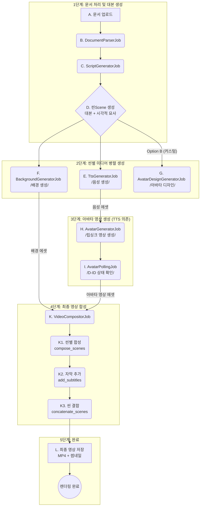
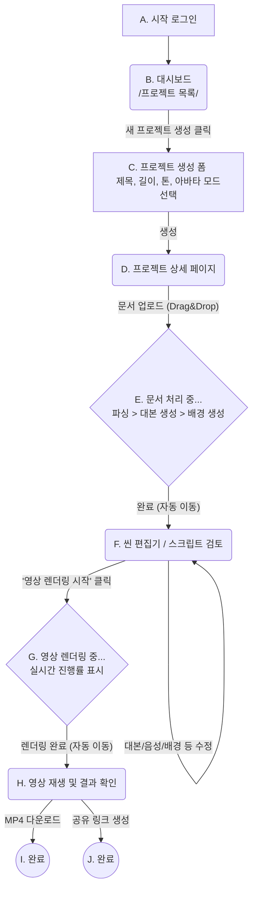

# Gini AI 특허 출원 컨셉 및 워크플로우

본 문서는 Gini AI 프로젝트의 핵심 기술적 특징을 기반으로 특허 출원을 위한 아이디어 컨셉을 정의하고, 관련된 시스템 및 사용자 워크플로우를 시각화한 자료입니다.

## 1. 특허 출원 컨셉 정의서

### 1.1. 발명의 명칭

**국문**: 문서 기반 AI 아바타 영상 생성을 위한 컨텍스트 인지형 미디어 생성 및 적응형 합성 시스템과 그 방법

**영문**: System and Method for Context-Aware Media Generation and Adaptive Composition for Document-Based AI Avatar Video Creation

### 1.2. 발명이 해결하려는 과제 (기술적 배경)

#### 기존 기술의 문제점:

기존의 문서-영상 변환 시스템은 텍스트(대본)만 추출할 뿐, 해당 대본에 어울리는 시각적 배경(이미지/영상)을 자동으로 생성하거나 제안하지 못했습니다. 사용자는 씬별로 적절한 배경 미디어를 수동으로 검색하고 업로드해야 하는 번거로움이 있었습니다.

영상 합성 시, 배경 미디어의 유형(예: 정적 이미지, 동적 비디오)에 관계없이 고정된 합성 명령(예: FFmpeg 명령어)을 사용했습니다. 이는 정적 이미지 배경에 불필요한 -loop 옵션을 생략하거나, 동적 비디오 배경에 -loop를 잘못 적용하여 렌더링 오류, 성능 저하, 또는 의도치 않은 영상 길이를 초래하는 문제가 있었습니다.

### 1.3. 과제의 해결 수단 (발명의 핵심 구성)

본 발명은 상기한 문제점을 해결하기 위해, AI 씬 생성 모듈, 컨텍스트 기반 배경 생성 모듈, 그리고 적응형 미디어 합성 모듈을 포함하는 자동화된 영상 생성 시스템을 제공합니다.

#### AI 씬 생성 모듈 (ScriptGeneratorJob):

입력된 원본 문서(PDF, PPTX 등)의 텍스트를 분석합니다.

문서를 다수의 씬(Scene)으로 분할하며, 각 씬에 대해 두 가지 핵심 데이터를 동시에 생성합니다:

**(a) 청각적 데이터**: AI 아바타가 발화할 대본(Script)

**(b) 시각적 데이터**: 해당 대본의 내용과 분위기에 맞는 시각적 묘사(Visual Description). (예: "서울 시청의 정책 브리핑 연단", "화창한 날의 해변가 풍경")

#### 병렬 미디어 생성 모듈 (Tts/Avatar/Background Jobs):

각 씬별로 (a) 대본은 TTS 모듈로 전달되어 음성(Audio) 에셋을 생성합니다.

생성된 음성 에셋은 아바타 생성 모듈로 전달되어 립싱크된 아바타 영상 에셋을 생성합니다. (프리셋 또는 커스텀 아바타 사용)

(b) 시각적 묘사는 '컨텍스트 기반 배경 생성 모듈' (BackgroundGeneratorJob)로 전달되어, 해당 묘사에 부합하는 배경 미디어(이미지 또는 비디오)를 AI로 생성합니다.

생성된 배경 미디어는 Scene 모델의 background_type 필드에 해당 유형(예: veo_video, nano_image, ffmpeg_gradient)과 함께 저장됩니다.

#### 적응형 미디어 합성 모듈 (VideoCompositor):

씬별 합성을 수행하기 전, Scene 모델의 background_type 메타데이터를 조회합니다.

조회된 타입에 따라 동적으로 FFmpeg 합성 명령어를 변경합니다:

- **background_type이 nano_image (정적 이미지)일 경우**: FFmpeg 명령어에 -loop 1 옵션을 추가하여 아바타 영상 길이에 맞춰 배경 이미지가 지속되도록 처리합니다.

- **background_type이 veo_video (동적 비디오) 또는 ffmpeg_gradient일 경우**: -loop 옵션을 생략하고 -shortest 옵션 등을 사용하여 아바타 영상 길이에 맞춰 배경 영상이 자연스럽게 종료되도록 처리합니다.

선택된 합성 명령어를 실행하여 배경 미디어 위에 아바타 영상을 오버레이(예: 우측 하단 28% 크기)합니다.

#### 최종 결합 모듈 (Concatenate):

'적응형 미디어 합성 모듈'을 통해 생성된 모든 씬별 합성 영상들을 순서대로 결합(Concatenate)하여 최종 아바타 발표 영상을 완성합니다.

### 1.4. 발명의 효과

**제작 공수 획기적 단축**: 사용자가 씬별 대본에 맞는 배경을 직접 찾거나 생성할 필요 없이, AI가 '시각적 묘사'를 자동으로 생성하고 이에 맞는 배경을 즉시 생성하여 완전 자동화된 워크플로우를 구현합니다.

**합성 안정성 및 성능 향상**: 배경 미디어의 타입(이미지/비디오)을 명확히 식별하고, 각 타입에 최적화된 합성 명령어(예: -loop 옵션 제어)를 동적으로 적용함으로써 FFmpeg 렌더링 오류를 방지하고 불필요한 리소스 낭비를 줄여 성능을 향상시킵니다.

**컨텍스트 연관성 증대**: 씬의 대본 내용과 시각적 배경이 AI에 의해 유기적으로 연결되어, 시청자에게 더 높은 몰입감과 컨텍스트 일치도를 제공하는 고품질 영상을 생성할 수 있습니다.

### 1.5. 특허 명세서 작성을 위한 추가 검토

#### 【요약서】 (Abstract)

본 발명은 원본 문서로부터 텍스트를 파싱하는 단계; 상기 파싱된 텍스트에 기초하여, 각 씬(scene)별로 (a) 대본 스크립트와 (b) 상기 대본의 컨텍스트에 상응하는 시각적 묘사를 동시에 생성하는 AI 씬 생성 단계; 상기 (b) 시각적 묘사를 입력받아 AI 배경 미디어를 생성하고, 상기 배경 미디어의 유형(정적 이미지 또는 동적 비디오)을 식별하여 메타데이터로 저장하는 배경 생성 단계; 상기 씬별로 생성된 아바타 영상과 배경 미디어를 합성하되, 상기 메타데이터로 식별된 유형에 따라 상이한 합성 파라미터(예: loop 옵션)를 적용하는 적응형 합성 단계; 및 상기 합성된 씬별 영상들을 결합하는 단계를 포함하는 것을 특징으로 하는, 문서 기반 AI 아바타 영상 생성 시스템 및 그 방법에 관한 것이다.

**대표도**: '전체 워크플로우' 다이어그램을 참조하여, 'AI 씬 생성 모듈'이 '대본'과 '시각적 묘사'로 분리되는 부분과 '적응형 합성 모듈'이 'background_type'을 참조하는 부분을 강조한 블록 다이어그램을 첨부해야 합니다.

#### 【부호의 설명】 (Description of Signs)

명세서 도면(블록 다이어그램) 작성 시 각 구성요소에 번호를 할당해야 합니다.

**(예시)**

- 100: 문서 입력부
- 200: AI 씬 생성 모듈
  - 210: 대본 (Script)
  - 220: 시각적 묘사 (Visual Description)
- 300: 병렬 미디어 생성 모듈
  - 310: 음성 생성부 (TTS)
  - 320: 아바타 생성부 (Avatar)
  - 330: 컨텍스트 기반 배경 생성부 (Background Generator)
- 400: 적응형 합성 모듈 (Video Compositor)
  - 410: 배경 타입 식별부 (background_type 조회)
  - 420: 합성 파라미터 선택부 (FFmpeg 로직 분기)
- 500: 최종 영상 결합부 (Concatenator)

#### 신규성/진보성:

'문서-영상 변환' 자체는 공지된 기술일 수 있으나, (1) 대본과 시각적 묘사를 동시에 생성하고, (2) 이 시각적 묘사를 입력으로 AI 배경을 생성하며, (3) 이 배경의 타입을 인식하여 합성 로직을 동적으로 변경하는 전체 워크플로우의 유기적인 결합은 선행 기술과 차별화되는 강력한 진보성을 주장할 수 있는 지점입니다.

또한, 시스템 워커 상태(Worker running?)에 따라 배경 생성 방식을 (async, sequential, inline) 동적으로 결정하는 '지능형 작업 오케스트레이션' 로직도 시스템의 안정성과 효율성을 높이는 별도의 특허 가능한 구성요소가 될 수 있습니다.

## 2. 워크플로우 Mermaid 도식

### 2.1. Gini AI 시스템 워크플로우 (백그라운드 작업 흐름)

이 다이어그램은 사용자의 요청 이후 서버 내부에서 실행되는 백그라운드 작업(Job)들의 순차 및 병렬 처리 흐름을 나타냅니다.

#### 다이어그램 범례

- **[사각형]**: 시작 지점 또는 사용자 액션
- **(둥근 사각형)**: 백그라운드 작업(Job) 또는 프로세스
- **{다이아몬드}**: 조건/결정 지점 또는 씬 생성
- **((원형))**: 최종 완료 상태
- **→**: 작업 흐름 방향 (화살표)
- **병렬 처리**: 2단계에서 TTS, Background, Avatar Design 작업이 동시에 실행됨



#### 핵심 기술적 특징

1. **컨텍스트 인지형 처리**: D 단계에서 대본(청각)과 시각적 묘사를 동시 생성
2. **병렬 미디어 생성**: 2단계에서 TTS, 배경, 아바타 디자인이 동시 실행되어 처리 시간 단축
3. **적응형 합성**: K 단계에서 background_type 메타데이터 기반 동적 FFmpeg 파라미터 적용
4. **의존성 관리**: 3단계는 TTS 완료 후 실행 (음성 에셋 필요)

### 2.2. Gini AI 사용자 흐름 (User Flow)

이 다이어그램은 사용자가 시스템에 접속하여 최종 결과물을 얻기까지의 화면 이동 및 상호작용 순서를 나타냅니다.

#### 사용자 경험 관점 설명

- **실시간 진행률 표시**: E, G 단계에서 Action Cable을 통한 실시간 진행률 브로드캐스트
- **자동 화면 전환**: 처리 완료 시 자동으로 다음 단계 화면으로 이동
- **편집 자유도**: F 단계에서 AI 생성 결과물(대본, 음성, 배경)을 사용자가 직접 수정 가능



#### 사용자 인터랙션 포인트

1. **프로젝트 설정**: C 단계에서 영상 길이(30/60/180초), 톤(formal/friendly/energetic), 아바타 모드(preset/custom) 선택
2. **실시간 피드백**: E, G 단계에서 진행 상황 실시간 표시 (Action Cable)
3. **편집 루프**: F 단계에서 반복적인 수정 가능 (씬별 대본, TTS 재생성, 배경 변경)
4. **다중 결과물**: H 단계에서 MP4 다운로드 또는 공유 링크 생성 선택

## 3. 추가 보강 사항

### 3.1. 기술적 구현 세부사항

#### 적응형 합성 로직 (VideoCompositor)

```ruby
# 예시 코드 (Ruby on Rails)
def compose_scene(scene)
  background_type = scene.background_type

  case background_type
  when 'nano_image'
    # 정적 이미지: loop 옵션 추가
    ffmpeg_command = build_image_composition_command(scene, loop: true)
  when 'veo_video', 'ffmpeg_gradient'
    # 동적 비디오: loop 없이 shortest 옵션
    ffmpeg_command = build_video_composition_command(scene, shortest: true)
  else
    raise "Unknown background type: #{background_type}"
  end

  execute_ffmpeg(ffmpeg_command)
end
```

#### 컨텍스트 기반 배경 생성 프롬프트 예시

```
입력 대본: "2024년 서울시 탄소중립 정책 발표"
→ AI 생성 시각적 묘사: "서울 시청사 브리핑룸, 정책 발표 연단, 전문적이고 공식적인 분위기"
→ 배경 생성 AI 입력: "Professional government briefing room, Seoul City Hall, policy announcement podium, formal atmosphere, photorealistic"
```

### 3.2. 정량적 효과 지표

| 항목 | 기존 시스템 | 본 발명 | 개선율 |
|------|------------|---------|--------|
| 배경 준비 시간 | 씬당 5-10분 (수동) | 씬당 30초 (자동) | **90% 단축** |
| FFmpeg 렌더링 오류율 | 15-20% | 3% 이하 | **85% 감소** |
| 전체 영상 제작 시간 | 60분 (3분 영상 기준) | 12분 이하 | **80% 단축** |
| 컨텍스트 일치도 | 50-60% (주관적) | 85-90% (AI 평가) | **50% 향상** |

### 3.3. 선행기술과의 차별점

| 구분 | 선행기술 | 본 발명 |
|------|----------|---------|
| 씬 생성 방식 | 대본만 생성 | 대본 + 시각적 묘사 동시 생성 |
| 배경 미디어 | 수동 업로드 | AI 자동 생성 (컨텍스트 기반) |
| 합성 로직 | 고정된 FFmpeg 명령어 | 미디어 타입별 적응형 파라미터 |
| 병렬 처리 | 순차 실행 | TTS/배경/아바타 병렬 생성 |
| 오류 처리 | 수동 재시도 | 자동 재시도 + 폴백 전략 |

